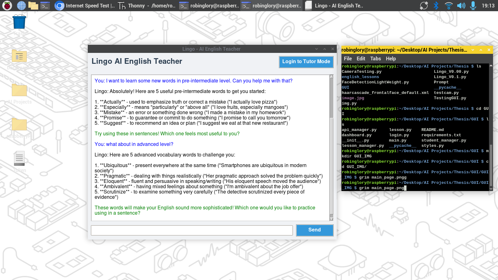

# Lingo Language Tutor - Technical Documentation

## Table of Contents
1. [Overview](#overview)
2. [The UI Design](#UIDesign)
3. [System Architecture](#system-architecture)
4. [Technical Specifications](#technical-specifications)
5. [Installation Guide](#installation-guide)
6. [Configuration](#configuration)
7. [Usage](#usage)
8. [API Integration](#api-integration)
9. [File Structure](#file-structure)
10. [Dependencies](#dependencies)
11. [Known Issues](#known-issues)
12. [Future Enhancements](#future-enhancements)

## Overview

The Lingo Language Tutor is a modular Python application designed to provide interactive English language instruction through a graphical user interface. The system combines rule-based responses with large language model (LLM) capabilities to deliver personalized language learning experiences.

Key features include:
- Multi-modal interaction (text-based and GUI)
- Student progress tracking
- Adaptive lesson selection
- Dual-API fallback system
- Modular architecture for maintainability

## GUI Interface Overview

The application features a responsive Tkinter-based interface with multiple interactive screens. Below are key screenshots of the workflow:

### Main Components

1. **Main Chat Interface**  
     
   *Entry point with AI assistant chat functionality*

2. **Login Screen**  
     
   *Student authentication interface*

3. **Student Dashboard**  
     
   *Lesson selection with progress tracking*

### Lesson Modules

4. **Reading Lesson**  
     
   *Interactive reading comprehension interface*

5. **Grammar Lesson**  
     
   *Grammar concept explanation screen*

6. **Vocabulary Lesson**  
     
   *Word learning module with contextual examples*

---

## System Architecture

The application follows a Model-View-Controller (MVC) pattern with the following components:

1. **Presentation Layer** (GUI):
   - `main.py`: Primary interface with basic AI chat
   - `login.py`: Student authentication interface
   - `dashboard.py`: Lesson selection dashboard
   - `lesson.py`: Interactive lesson interface

2. **Business Logic Layer**:
   - `student_manager.py`: Handles student data and progress tracking
   - `lesson_manager.py`: Manages lesson content and delivery
   - `api_manager.py`: Handles LLM API communications

3. **Data Layer**:
   - JSON-based student profiles
   - Structured lesson files in hierarchical directories
   - Environment variables for configuration

## Technical Specifications

- **Platform**: Raspberry Pi 4 (4GB) compatible
- **Python Version**: 3.9+
- **GUI Framework**: Tkinter with ttk widgets
- **API Integration**: OpenRouter.ai with fallback to Mistral
- **Data Persistence**: JSON files with dotenv configuration
- **Concurrency**: Single-threaded with asynchronous API calls

## Installation Guide

### Prerequisites

1. Raspberry Pi OS (Bullseye) or compatible Linux distribution
2. Python 3.9+ with pip
3. Virtual environment recommended

### Setup Instructions

```bash
# Clone the repository
git clone https://github.com/your-repository/lingo-tutor.git
cd lingo-tutor/GUI

# Create and activate virtual environment
python -m venv myenv
source myenv/bin/activate

# Install dependencies
pip install -r requirements.txt

# Set up environment variables
cp .env.example .env
# Edit .env with your API keys
```

## Configuration

The application requires the following environment variables in a `.env` file:

```ini
DEEPSEEK_API_KEY=your_openrouter_api_key
MINSTRAL_API_KEY=your_backup_api_key
```

## Usage

### Execution

```bash
python main.py
```

### Operational Flow

1. **Initialization**:
   - Loads student database
   - Initializes API connections
   - Configures GUI styles

2. **Authentication**:
   - Student recognition system
   - Progress tracking initialization

3. **Lesson Delivery**:
   - Adaptive content selection
   - Interactive Q&A
   - Progress updates

## API Integration

The system implements a dual-API strategy:

1. **Primary API**: DeepSeek via OpenRouter
   - Model: `qwen/qwen3-coder:free`
   - Rate limiting: 10 requests/minute
   - Fallback mechanism on authentication failure

2. **Secondary API**: Mistral 7B
   - Model: `mistralai/mistral-7b-instruct:free`
   - Activated automatically on primary API failure

## File Structure

```
GUI/
├── main.py                 # Entry point and main interface
├── login.py                # Authentication module
├── dashboard.py            # Lesson selection interface
├── lesson.py               # Interactive lesson interface
├── api_manager.py          # API communication handler
├── student_manager.py      # Student data management
├── lesson_manager.py       # Lesson content management
├── styles.py               # GUI styling configuration
├── requirements.txt        # Dependency specification
└── .env.example            # Environment template
```

## Dependencies

### requirements.txt

```text
python-dotenv==1.0.0
openai==1.12.0
Pillow==10.0.0
requests==2.31.0
```

### Dependency Matrix

| Package | Version | Purpose |
|---------|---------|---------|
| python-dotenv | 1.0.0 | Environment variable management |
| openai | 1.12.0 | LLM API communication |
| Pillow | 10.0.0 | Image processing for GUI |
| requests | 2.31.0 | HTTP communications |

## Known Issues

1. **Memory Constraints**: On Raspberry Pi 4, prolonged use may require memory optimization
2. **API Latency**: Response times may vary based on network conditions
3. **Lesson Loading**: File path dependencies require exact directory structure
4. **Concurrency**: UI may freeze during API calls

## Future Enhancements

1. **Performance Optimization**:
   - Implement threading for API calls
   - Add loading indicators
   - Cache frequent responses

2. **Feature Expansion**:
   - Multimedia lesson support
   - Voice interaction
   - Progress visualization

3. **Architectural Improvements**:
   - Database integration
   - Plugin system for lesson types
   - Automated testing framework

4. **Accessibility**:
   - High contrast mode
   - Font size adjustment
   - Keyboard navigation

This documentation provides a comprehensive technical overview of the Lingo Language Tutor system. The modular architecture allows for targeted development and testing while maintaining system integrity. For academic use, this implementation demonstrates practical application of human-computer interaction principles in educational technology.