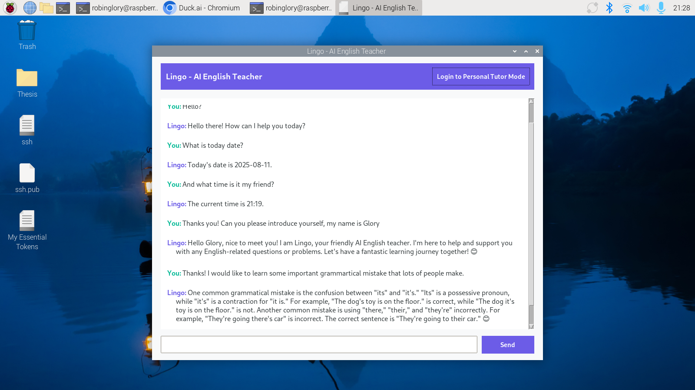

# AI Driven Robotic Head for Language Learning Assistance - Technical Documentation

## Table of Contents
1. [Overview](#overview)
2. [The UI Design](#guidesign)
3. [System Architecture](#system-architecture)
4. [Technical Specifications](#technical-specifications)
5. [Installation Guide](#installation-guide)
6. [Configuration](#configuration)
7. [Usage](#usage)
8. [API Integration](#api-integration)
9. [File Structure](#file-structure)
10. [Dependencies](#dependencies)
11. [Known Issues](#known-issues)
12. [Future Enhancements](#future-enhancements)

---

## Overview

The **AI Driven Robotic Head for Language Learning Assistance** or **Lingo Language Tutor** is a modular Python application designed to deliver interactive English language instruction via a Tkinter-based graphical user interface. The system combines rule-based teaching, AI-powered explanations, student progress tracking, and digital textbook integration to create a personalized learning experience.

**Key Features:**
- Multi-modal interaction (chat, lesson modules, digital textbook)
- Student progress tracking with **TinyDB**
- Adaptive lesson sequencing based on mastery
- Dual-API fallback system for reliable AI responses
- Export lessons to academic-style PDFs with cover pages

---

## GUIDesign

### Interface Overview
The application features a **responsive Tkinter interface** with enhanced styles for readability and academic presentation.

### Main Components:
1. **Main Chat Interface**  
   *Entry point for AI assistant chat*  
   

2. **Login Screen**  
   *Student authentication and profile loading*  
   

3. **Student Dashboard**  
   *Lesson selection, progress tracking, and textbook access*  
   

4. **Grammar Section**  
   *Grammar Section where the user can learns the Grammar*  
   

5. **Reading Section**  
   *Lingo will help you learns lots of Intermediate and Pre-intermediate level readings.*  
   

6. **Vocabulary Sections**  
   *Our Lingo will teach ther user lots of essential vocabs.*  
   

---

## System Architecture

The app follows an **MVC-like** pattern:

1. **Presentation Layer (GUI)**
   - Tkinter-based screens: login, dashboard, lessons, textbook viewer  
   - Custom styles for academic look & feel

2. **Business Logic Layer**
   - `student_manager.py` – Handles TinyDB student profiles & progress
   - `lesson_manager.py` – Loads lessons & tracks completion
   - `textbook_manager.py` – Manages PDF/textbook content display
   - `api_manager.py` – AI API communications

3. **Data Layer**
   - **TinyDB** for student profiles & lesson progression
   - JSON lesson definitions
   - PDF/Textbook files
   - `.env` config for API keys

---

## Technical Specifications

- **Platform**: Raspberry Pi 4 (4GB) compatible
- **Python**: 3.9+
- **GUI Framework**: Tkinter with ttk styling
- **Database**: TinyDB (lightweight, file-based)
- **APIs**: OpenRouter (Qwen primary, Mistral fallback)
- **PDF Export**: ReportLab with academic formatting
- **Data Persistence**: JSON + TinyDB

---

## Installation Guide

### Prerequisites
- Raspberry Pi OS (Bullseye) or compatible Linux distro
- Python 3.9+ with `pip`
- Virtual environment recommended

### Setup
```bash
# Clone the repo
git clone https://github.com/robinglory/AI-Driven-Robotic-Head-for-Language-Learning-Assistance.git
cd AI-Driven-Robotic-Head-for-Language-Learning-Assistance/GUI

# Create & activate venv
python -m venv myenv
source myenv/bin/activate

# Install dependencies
pip install -r requirements.txt

# Setup environment variables
cp .env.example .env
nano .env  # add your API keys
```

---

## Configuration

Add to `.env`:
```ini
QWEN_API_KEY=your_openrouter_api_key
MINSTRAL_API_KEY=your_backup_api_key
```

---

## Usage

```bash
python main.py
```

**Workflow:**
1. **Login** → Load/create student profile from TinyDB  
2. **Dashboard** → Choose lesson or textbook chapter  
3. **Lesson Delivery** → Content adapts to prior progress  
4. **Progress Tracking** → Stores completion & mastery in TinyDB  
5. **PDF Export** → Generate academic-style lesson PDFs with title page

---

## API Integration

**Primary API** – Qwen (OpenRouter)  
**Secondary API** – Mistral 7B fallback

Both are wrapped in `api_manager.py` with provider switching, retries, and graceful fallbacks.

---

## File Structure

```
GUI/
├── main.py
├── login.py
├── dashboard.py
├── lesson.py
├── textbook_viewer.py
├── api_manager.py
├── student_manager.py
├── lesson_manager.py
├── textbook_manager.py
├── styles.py
├── requirements.txt
└── .env.example
```

---

## Dependencies

**requirements.txt**
```text
python-dotenv==1.0.0
openai==1.12.0
Pillow==10.0.0
requests==2.31.0
tinydb==4.8.0
reportlab==4.0.8
```

**Purpose:**
| Package | Purpose |
|---------|---------|
| python-dotenv | Environment management |
| openai | LLM API |
| Pillow | Image handling |
| requests | HTTP requests |
| tinydb | Student progress database |
| reportlab | PDF export |

---

## Known Issues
- UI may freeze on slow API calls (threading planned)
- TinyDB file can grow if not periodically cleaned
- PDF export speed depends on lesson length

---

## Future Enhancements
- Voice-based interaction
- Animated lesson transitions
- Rich media in lessons
- Progress analytics dashboard