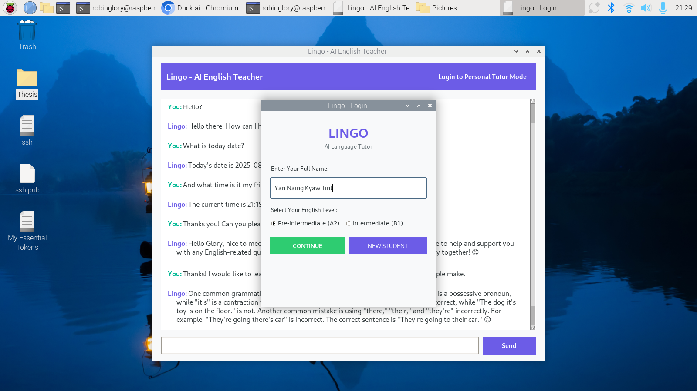
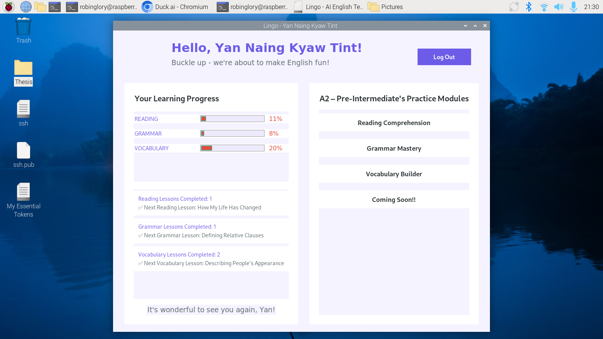
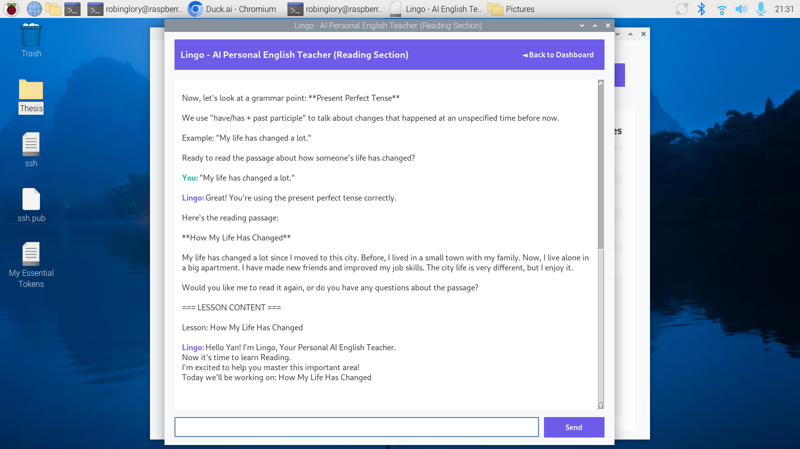
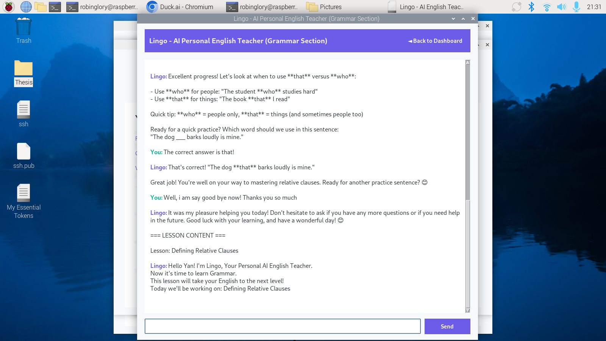
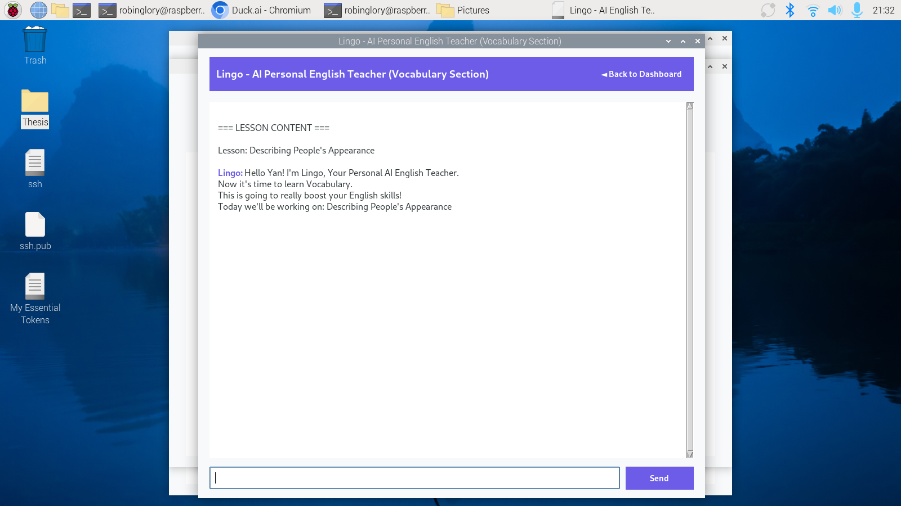

# AI Driven Robotic Head for Language Learning Assistance - Technical Documentation

## Table of Contents
1. [Overview](#overview)  
2. [Hardware Integration](#hardware-integration)  
3. [Software Components](#software-components)  
4. [The UI Design](#guidesign)  
5. [System Architecture](#system-architecture)  
6. [Technical Specifications](#technical-specifications)  
7. [Installation Guide](#installation-guide)  
8. [Configuration](#configuration)  
9. [Usage](#usage)  
10. [API & AI Integration](#api--ai-integration)  
11. [File Structure](#file-structure)  
12. [Dependencies](#dependencies)  
13. [Testing & Results](#testing--results)  
14. [Known Issues](#known-issues)  
15. [Future Enhancements](#future-enhancements)  

---

## Overview
### Experimental Setup
1. **Final Setup Interface**  
   *Lingo Laguage Learning Assistance*  
   

The **AI Driven Robotic Head for Language Learning Assistance** (codenamed **Lingo**) is a combined **software + hardware platform** that delivers personalized English tutoring through natural conversation, interactive lessons, and human-like robotic expressions.  

The system runs on **Raspberry Pi 4** and integrates:  
- **GUI Application (Tkinter)** for lessons, progress tracking, and digital textbooks.  
- **AI Pipeline** with speech recognition (STT), large language models (LLM), and speech synthesis (TTS).  
- **Robotic Head** powered by Arduino + PCA9685 servo controller for eyes, mouth, and neck gestures.  

**Key Achievements & Features:**
- Fully functional **GUI** with login, student dashboard, grammar, vocabulary, and reading lessons.  
- **Voice interaction loop**: STT (Faster-Whisper) → LLM (OpenRouter) → TTS (Piper).  
- **Persistent Piper engine** for streaming, low-latency text-to-speech.  
- **TinyDB database** for storing students and lesson progress.  
- **Face recognition login** (LBPH + Haar cascade).  
- **Arduino-controlled robotic head** with lifelike gestures (listen, think, talk).  
- **Servo limits & safety controls** for mouth, eyes, and neck.  
- **Academic-style PDF export** for completed lessons.  

---
## Hardware Integration

The robotic head is driven by **Arduino UNO + PCA9685** servo controller with external 12V → 6V regulated power.  

**Servo Ranges (degrees):**  
- Mouth: 25° → 60°  
- Neck: 45° → 135°  
- Eyes Left/Right: 50° → 120°  
- Eyes Up/Down: 130° → 170°  

**Features:**  
- Event-driven serial commands (`listen`, `think`, `talk`, `stop`, etc.).  
- Smooth return to **idle pose** after each gesture.  
- Human-like **thinking**, **listening**, and **talking** animations.  
- Integration with GUI stages (pause tracking during “think”/“talk”).  

---

## Software Components

- **main.py** – Tkinter main app with login, dashboard, and lesson screens.  
- **lesson.py** – Lesson mode with stricter system prompts and TTS-first pipeline.  
- **gui_serial.py** – Serial bridge for controlling Arduino gestures.  
- **FaceTracker** – Controls robot eye tracking during idle states.  
- **VADRecorder** – WebRTC-based voice activity detection for clean STT.  
- **LLMHandler** – Multi-provider LLM calls with failover & streaming hedge.  
- **PiperEngine** – Persistent streaming TTS with auto sample-rate handling.  

---

## GUIDesign

### Interface Overview
The application features a **responsive Tkinter interface** with enhanced styles for readability and academic presentation.

### Main Components:
1. **Main Chat Interface**  
   *Entry point for AI assistant chat*  
   

2. **Login Screen**  
   *Student authentication and profile loading*  
   

3. **Student Dashboard**  
   *Lesson selection, progress tracking, and textbook access*  
   

4. **Grammar Section**  
   *Grammar Section where the user can learns the Grammar*  
   

5. **Reading Section**  
   *Lingo will help you learns lots of Intermediate and Pre-intermediate level readings.*  
   

6. **Vocabulary Sections**  
   *Our Lingo will teach ther user lots of essential vocabs.*  
   

---

## System Architecture

The app follows an **MVC-like** pattern:

1. **Presentation Layer (GUI)**
   - Tkinter-based screens: login, dashboard, lessons, textbook viewer  
   - Custom styles for academic look & feel

2. **Business Logic Layer**
   - `student_manager.py` – Handles TinyDB student profiles & progress
   - `lesson_manager.py` – Loads lessons & tracks completion
   - `textbook_manager.py` – Manages PDF/textbook content display
   - `api_manager.py` – AI API communications

3. **Data Layer**
   - **TinyDB** for student profiles & lesson progression
   - JSON lesson definitions
   - PDF/Textbook files
   - `.env` config for API keys

---

## Technical Specifications

- **Platform**: Raspberry Pi 4 (4GB RAM)  
- **Python**: 3.9+  
- **GUI**: Tkinter with ttk styling  
- **Database**: TinyDB + JSON  
- **STT**: Faster-Whisper (int8, tiny.en)  
- **TTS**: Piper (streaming engine)  
- **LLM**: OpenRouter (Qwen primary, Mistral/GPT fallback)  
- **Face Recognition**: OpenCV LBPH + Haar cascades  
- **Servo Control**: Arduino UNO + PCA9685  

---

## Installation Guide

### Prerequisites
- Raspberry Pi OS (Bullseye) or compatible Linux distro
- Python 3.9+ with `pip`
- Virtual environment recommended

### Setup
```bash
# Clone the repo
git clone https://github.com/robinglory/AI-Driven-Robotic-Head-for-Language-Learning-Assistance.git
cd AI-Driven-Robotic-Head-for-Language-Learning-Assistance/GUI

# Create & activate venv
python -m venv myenv
source myenv/bin/activate

# Install dependencies
pip install -r requirements.txt

# Setup environment variables
cp .env.example .env
nano .env  # add your API keys
```

---

## Configuration

Add to `.env`:
```ini
QWEN_API_KEY=your_openrouter_api_key
MINSTRAL_API_KEY=your_backup_api_key
```

---

## Usage

```bash
python main.py
```

**Workflow:**
1. **Login** → Login via face recognition / new student signup. 
2. **Dashboard** → Select lessons from dashboard.
3. **Implement STT**  → Voice or text input.
4. **Lingo Head Implement** → Robot responds with voice + gestures.
5. **Lesson Delivery** → Content adapts to prior progress  
6. **Progress Tracking** → Stores completion & mastery in TinyDB  
7. **PDF Export** → Generate academic-style lesson PDFs with title page

---

## API & AI Integration

1. Speech Recognition: Faster-Whisper (local, int8).
2. Language Model: OpenRouter (Qwen + Mistral failover).
   **Primary API** – Qwen (OpenRouter)  
   **Secondary API** – Mistral 7B fallback  (Both are wrapped in `api_manager.py` with provider switching, retries, and graceful fallbacks.)
3. Speech Synthesis: Piper (streaming, low-latency).
4. Face Recognition: OpenCV LBPH + Haar Cascade.

---

## File Structure

```
GUI/
├── main.py
├── lesson.py
├── login.py
├── dashboard.py
├── gui_serial.py
├── face_tracker.py
├── student_manager.py
├── lesson_manager.py
├── styles.py
├── conversations.json
├── students.json
├── requirements.txt
└── .env.example

```

---

## Dependencies

**requirements.txt**
```text
python-dotenv==1.0.0
openai==1.12.0
Pillow==10.0.0
requests==2.31.0
tinydb==4.8.0
reportlab==4.0.8
faster-whisper
webrtcvad
sounddevice
opencv-python
```

**Purpose:**
| Package        | Purpose                        |
| -------------- | ------------------------------ |
| faster-whisper | Local STT                      |
| webrtcvad      | Voice activity detection       |
| sounddevice    | Audio playback/record          |
| opencv-python  | Face recognition, Haar cascade |
| python-dotenv  | Env var management             |
| tinydb         | Student database               |
| reportlab      | PDF export                     |
| Pillow         | Image handling                 |
| requests       | API HTTP calls                 |

---

## Testing & Results
Latency (Raspberry Pi 4)
  1. STT: ~7.5s (tiny.en, int8)
  2. LLM response: <3s (Qwen/Mistral)
  3. TTS: <2s per chunk
Gesture Control
  1. Smooth servo transitions with PCA9685.
  2. Realistic human-like “listen / think / talk” animations.
Face Recognition
  1. Reliable login using LBPH with 20+ training images per student.

---
## Known Issues
- TinyDB file can grow if not periodically cleaned
- PDF export speed depends on lesson length
- GUI may hang during slow LLM calls (threading planned).
- Whisper int8 still ~7s latency (could improve with faster models).
- Piper voice selection limited to trained JSON configs.


---

## Future Enhancements
- Multi-language support (beyond English).
- Web-based interface (Flask/React).
- Rich media lessons (images, videos).
- Improved latency with quantized STT/LLM models.
- Servo gesture learning from real human data.
- Animated lesson transitions
- Progress analytics dashboard
